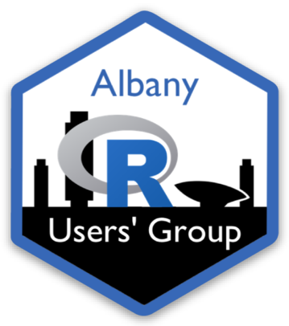

<a href='https://fall2021.data606.net'></a>

Contact: [Jason Bryer, Ph.D.](mailto:jason@bryer.org)  
Website: https://albanyrusers.org  
Meetup Page: https://www.meetup.com/Albany-R-Users-Group/  
Slack Channel: [albanyrusers.slack.com](https://join.slack.com/t/bryer/shared_invite/zt-zkfnvcfo-ftJ_z~OrbiQv6dB5TYlyIA)  

This website was built using the [Blogdown](https://github.com/rstudio/blogdown) and the [Ananke theme]( https://github.com/theNewDynamic/gohugo-theme-ananke).

Pull requests are welcome. Once the Github repository has been cloned locally, you can serve the site using the `serve_site` function and build the site (prior to submitting a pull request) using the `build_site` function.

```{r, eval = FALSE}
blogdown::serve_site()
blogdown::build_site()
```
